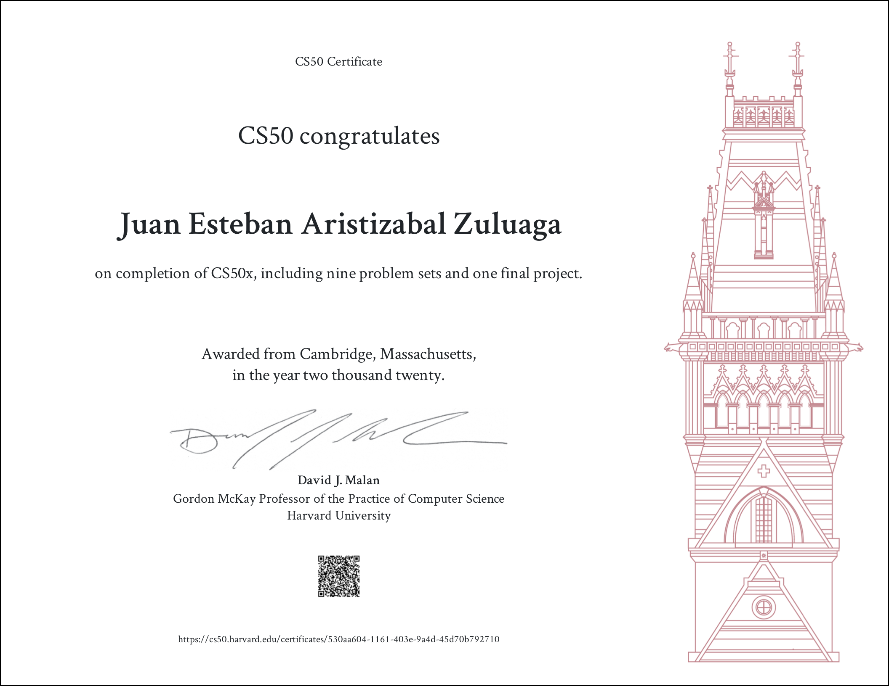

# Harvard's CS5x 2020: Introduction to Computer Science

In this repository you will find the solutions to all the problem sets
of Harvard's CS5x (2020).

Please review this solutions only if you have already worked on your own
solution thorughly and you still can't find the answer.

Please take a look at my final project: PHYS Simulation! A web app and API
where you can request physics simulations:

* [PHYS Simulation demo](https://www.youtube.com/watch?v=2QGRTdbjzLU)
* [PHYS Simulation GitHub repository](https://github.com/jearistiz/phys_simulation)
* [PHYS Simulation documentation](https://phys-simulation.readthedocs.io)

My CS50x certificate :)

